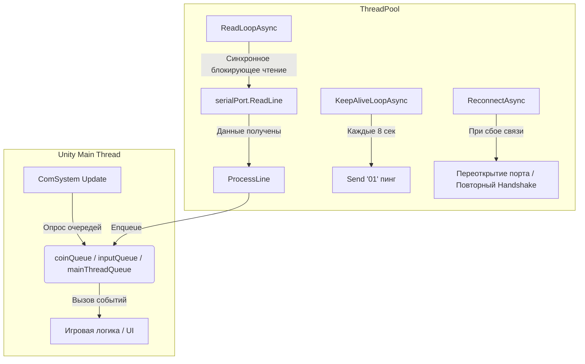

# Архитектура аппаратной интеграции и COM-взаимодействия

В этом руководстве описывается архитектура аппаратной интеграции в `Danro Jump` — принципы взаимодействия Unity-приложения с физической платой управления аркадного автомата через последовательный COM-порт.

---

## 1. Обзор аппаратной платформы

Аркадный автомат управляется специализированным контроллером (микроконтроллером), который опрашивает органы управления автомата и управляет периферийными устройствами:
- **Органы ввода (Inputs):** джойстик (влево, вправо), кнопка старта, монетоприемник (Coin Acceptor), датчики выдачи призов (оптопары хопперов и ячеек витрины).
- **Органы вывода (Outputs):** светодиодная подсветка автомата (LED-ленты), моторы выдачи призов (хоппер монет, диспенсер призов витрины).

Связь между игровым ПК и контроллером осуществляется по кабелю USB-to-UART (виртуальный COM-порт) на скорости `115200` бод.

---

## 2. Протокол обмена и команды

Обмен информацией ведется текстовыми строками, разделяемыми символами перевода строки `\n` или `\r\n`. Каждая команда или сообщение представляет собой текстовый пакет.

### 2.1. Инициализация и Авторизация (Handshake)
Для предотвращения использования неавторизованного оборудования и защиты прошивки контроллера реализована двухсторонняя криптографическая проверка на базе алгоритма AES-128:
1. **Запрос роли:** При открытии порта ПК отправляет команду запроса роли `97` (команда `roleRequestCommand`).
2. **Ответ платы:** Плата возвращает строку `ROLE:<role>`, например `ROLE:main` для главного игрового контроллера или `ROLE:vitrina` для контроллера призового стенда.
3. **Защищенное рукопожатие (CHAL / RAES):**
   - Компьютер генерирует случайный 16-байтовый массив, шифрует его по алгоритму AES-128 с секретным ключом проекта и отправляет Hex-строку плате в виде команды `CHAL:<hex_block>`.
   - Плата расшифровывает блок на своей стороне, прибавляет к нему контрольную соль, шифрует обратно и возвращает ответ `RAES:<hex_block>`.
   - Компьютер расшифровывает ответ платы и сравнивает с исходными данными. В случае успеха плата переводится в состояние **Operational** (рабочее состояние).
   - Если проверка провалена, подключение закрывается.

### 2.2. Потоки данных в рабочем режиме
- **Запрос состояния ввода (Пинг/Keep-Alive):** Компьютер с интервалом `8` секунд шлет команду опроса ввода (обычно `01`).
- **События ввода (Input Messages):** Плата отправляет строку состояния кнопок в формате `INPUT:<bitmask>`, где каждый бит соответствует нажатой кнопке или датчику:
  - Бит 0: кнопка влево
  - Бит 1: кнопка вправо
  - Бит 2: кнопка старта/выбора
  - Бит 3: сигнал монетоприемника (импульс зачисления кредита)
  - Бит 4: оптический датчик выдачи приза хоппером
- **Команды вывода (Output Commands):**
  - Освещение: команды управления цветом и анимацией подсветки (например, переключение на зеленый при старте).
  - Выдача приза: команда запуска мотора хоппера `12` или открытие конкретной ячейки призовой витрины.

---

## 3. Многопоточная архитектура в Unity

Последовательные порты в .NET/Unity работают медленно и синхронно. Блокировка главного потока Unity операциями ввода-вывода приведет к микрофризам игры (Stuttering), что недопустимо для динамичного платформера.

Для решения этой проблемы в `ComSystem` реализована полностью асинхронная многопоточная модель на базе `UniTask` и пула потоков (`ThreadPool`):



### 3.1. Основные циклы (Tasks)

1. **ReadLoopAsync (Цикл чтения):**
   Выполняется в фоновом потоке на `ThreadPool`. Вызывает синхронный блокирующий метод `ReadLine()`.
   Чтобы поток не висел заблокированным вечно при отсутствии данных, таймаут чтения (`ReadTimeout`) в настройках последовательного порта выставлен на `50` миллисекунд. Каждые 50мс вызов прерывается по `TimeoutException`, поток просыпается, проверяет токен отмены (`CancellationToken.IsCancellationRequested`) и уходит на следующий цикл ожидания.

2. **KeepAliveLoopAsync (Цикл контроля связи):**
   Каждые 8 секунд отправляет на плату запрос ввода. Если плата не присылает ответный `INPUT` пакет в течение 3 попыток подряд (`missedInputResponsesBeforeReconnect = 3`), это классифицируется как потеря связи, и запускается процедура переподключения.

3. **ReconnectAsync (Цикл автореконнекта):**
   При потере пингов или возникновении системной ошибки ввода-вывода (`IOException` в `ReadLoop` при отключении USB-кабеля):
   - Переводит устройство в статус `isOperational = false`.
   - Сбрасывает имя роли и MAC-адрес.
   - Закрывает порт.
   - Запускает цикл из 10 попыток открыть порт заново с интервалом в 1 секунду. При каждой попытке проверяется отмена токена, чтобы не открыть порт в фоне во время выхода из игры.
   - При успешном переоткрытии порта автоматически инициируется повторная авторизация (Handshake) и плата возвращается в строй без перезапуска игры.

### 3.2. Graceful Shutdown (Безопасный выход)

В .NET на Windows вызов `SerialPort.Close()` или `.Dispose()` во время активного блокирующего чтения в параллельном потоке гарантированно приводит к зависанию (Deadlock) драйвера порта и зависанию всего приложения Unity при выходе.

Для предотвращения этого в методе `ComDeviceConnection.Dispose` реализован двухэтапный выход:
1. Вызывается `localCts.Cancel()`, сигнализируя фоновым потокам о необходимости завершения.
2. Главный поток делает паузу `System.Threading.Thread.Sleep(80)`. Так как таймаут чтения порта равен 50мс, за 80мс фоновый поток чтения гарантированно успевает проснуться по таймауту, обнаружить отмену токена и безопасно завершить работу.
3. Только после этого вызывается `ClosePort()`, закрывающий и освобождающий последовательный порт под блокировкой `lock (ioLock)`.

---

## 4. Потокобезопасная маршрутизация

Поскольку фоновые циклы работают в потоках `ThreadPool`, они не могут напрямую вызывать методы Unity API (изменение UI, спавн объектов, проигрывание звуков), так как Unity API не является потокобезопасным.

Для передачи данных в главный поток используются потокобезопасные очереди `ConcurrentQueue`:
- `coinQueue` — очередь зачислений монет.
- `inputQueue` — очередь нажатий клавиш управления.
- `mainThreadQueue` — очередь произвольных делегатов `Action` (для логов, статусов подключения и т.д.).

Метод `Update()` класса `ComSystem` выполняется в главном потоке Unity каждый кадр. Он опрашивает эти очереди и безопасно вызывает соответствующие Unity-события:

```csharp
private void Update()
{
    // Перенос общих действий в главный поток
    while (mainThreadQueue.TryDequeue(out Action action))
    {
        action?.Invoke();
    }

    // Зачисление кредитов
    while (coinQueue.TryDequeue(out _))
    {
        AddPaymentImpulse(1);
    }

    // Обработка нажатий управления
    while (inputQueue.TryDequeue(out ComInputMessage message))
    {
        if (message.DeviceId == CurrentMainDeviceId)
        {
            mainInputReceived.Invoke(message.InputBits);
        }
    }
}
```

---

## 5. Рекомендации по разработке и отладке

1. **Эмуляция клавиатурой:** Для тестирования без физической платы в Unity Editor или Development-сборках включена эмуляция: нажатие клавиши `F6` генерирует импульс монеты.
2. **Логирование:** В инспекторе `ComSystem` можно включать каналы отладки (`logLifecycle`, `logCredits`, `logRawEvents`), чтобы изолировать проблемы с подключением, зачислением денег или обработкой протокола.
3. **Использование блокировок:** Любой доступ к объекту `SerialPort` (запись `WriteLine` или закрытие `Close`) должен производиться строго внутри блока `lock (ioLock)` для исключения одновременного обращения из разных потоков.
