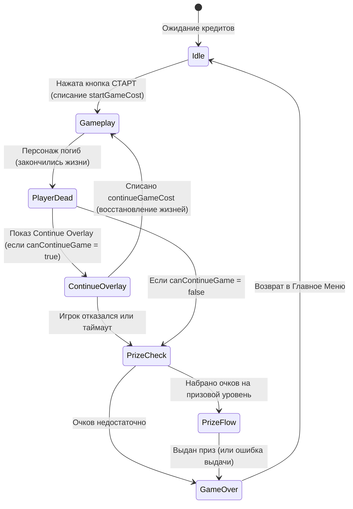

# Экономика игры и призовая система

В этом руководстве описывается архитектура игровой экономики, баланса кредитов и системы выдачи призов в `Danro Jump`.

---

## 1. Экономика кредитов и монеты

Игра функционирует как коммерческий аркадный аппарат (Amusement Arcade Machine). Все финансовые параметры настраиваются администратором через сервисное меню и сохраняются в файл `service-settings.json`.

### 1.1. Баланс кредитов (Credits Balance)
Зачисление денег в игру обрабатывается аппаратно через монетоприемник (подключается к `ComSystem`):
- Каждый физический импульс с монетоприемника (вставка монеты/жетона) пересылается через COM-порт и зачисляет `1` платежный импульс (`paymentImpulse`).
- В настройках задается стоимость одного импульса (`payment.paymentImpulseCost`) и валюта (`payment.currency`).
- Администратор может включить режим **Free Play** (`payment.freeGame = true`), при котором игра становится бесплатной.

### 1.2. Стоимость игры (Game Cost)
- **Старт игры (Start Cost):** Стоимость запуска новой игры задается параметром `payment.startGameCost` (в кредитах).
- **Продолжение игры (Continue Cost):** Стоимость продолжения раунда в случае гибели персонажа задается параметром `payment.continueGameCost` (в кредитах).
- **Сохранение кредитов:** В зависимости от настройки `payment.saveCreditsBetweenSessions`, неиспользованные кредиты могут либо обнуляться при завершении сессии, либо сохраняться в PlayerPrefs (`Com.Credits`) и переноситься на следующий запуск игры.

---

## 2. Жизненный цикл игровой сессии

Сессия игрока инкапсулирована в класс `GameplaySession.cs`:

### 2.1. Управление жизнями и продолжение
При старте раунда игроку выдается начальное количество жизней (`gameplay.startLives`). При падении персонажа или контакте с врагом жизнь сгорает.
Когда жизни достигают 0:
1. Если продолжение игры включено в настройках (`gameplay.canContinueGame = true`), открывается оверлей `ContinueGameOverlayWindow` с таймером обратного отсчета (10 секунд).
2. Игрок может нажать **«ПРОДОЛЖИТЬ»**, если на балансе достаточно кредитов. При этом списывается `continueGameCost`, игроку добавляются дополнительные жизни (`gameplay.additionalLives`), и игра возобновляется с текущей высоты без потери набранных очков.
3. Если продолжение выключено в настройках, игра сразу переходит к этапу проверки призов и завершению сессии.

---

## 3. Призовая система (Prize System)

`Danro Jump` поддерживает выдачу физических призов (капсул, игрушек или монет) при достижении игроком определенного количества очков.

### 3.1. Уровни наград (Prize Levels)
Призы разделены на три уровня:
- **Бронзовый (Bronze)**
- **Серебряный (Silver)**
- **Золотой (Gold)**

Уровни настраиваются в сервисных настройках: для каждого уровня задается минимальный порог очков. Если игрок набирает указанный счет, он квалифицируется на получение приза соответствующего уровня (выбирается наивысший доступный уровень).

### 3.2. Процедура выдачи приза (Prize Flow)
Процесс координирует `PrizeFlowService.cs`:
1. По окончании игры проверяется набранный счет.
2. Если призовой уровень достигнут, игра переходит на сцену выдачи призов (или показывает оверлей выдачи).
3. `PrizeFlowService` отправляет команду на плату через `ComSystem` (например, открыть ячейку витрины с помощью мотора или запустить хоппер выдачи монет).
4. Во время выдачи игра ожидает от платы подтверждения об успешном срабатывании оптического датчика выдачи приза.
5. **Обработка ошибок:** Если датчик не сработал в течение времени ожидания (`prizes.showPrizeError = true`), на экране показывается сообщение об ошибке выдачи приза с номером телефона поддержки (`prizes.phoneNumber`) и QR-кодом для связи.

---

## 4. Логирование и эксплуатационная статистика

Для контроля работы автомата, учета выручки и выдачи призов в системе реализован сбор эксплуатационной статистики.

### 4.1. История игровых сессий (Gameplay History)
Каждая сыгранная сессия логируется в структуру `GameplaySessionRecord`:
- **SessionId:** уникальный идентификатор раунда.
- **Score:** набранные очки.
- **CoinsCollected:** количество собранных в игре монет.
- **HeightReached:** максимальная достигнутая высота.
- **DeathsCount:** количество смертей.
- **RewardKind:** тип выданного приза (Bronze/Silver/Gold/None).
- **IsRewardDelivered:** успешность физической выдачи приза.
- **Timestamp:** дата и время раунда.

История сессий ограничена **последними 50 записями** (для предотвращения переполнения диска) и хранится в файле `prize-session-state.json` в `Application.persistentDataPath`. Загрузкой и сериализацией истории управляет `PrizeSessionStateService` через `JsonPrizeSessionStateRepository`.

### 4.2. Сервисная статистика (Statistics Summary)
В сервисном меню (вкладка статистики, строящаяся с помощью `ServiceSettingsStatisticsSummaryBuilder`) администратор может просмотреть:
- **Общие показатели:** Общую выручку (количество зачисленных монет), суммарное количество сыгранных раундов, количество выданных призов каждого уровня.
- **Средние показатели:** Средний счет игрока, среднюю достигнутую высоту и среднее количество собранных монет на основе истории сессий.
- **Лог последних игр:** Список 5 последних сыгранных раундов с детальной информацией по каждому.
